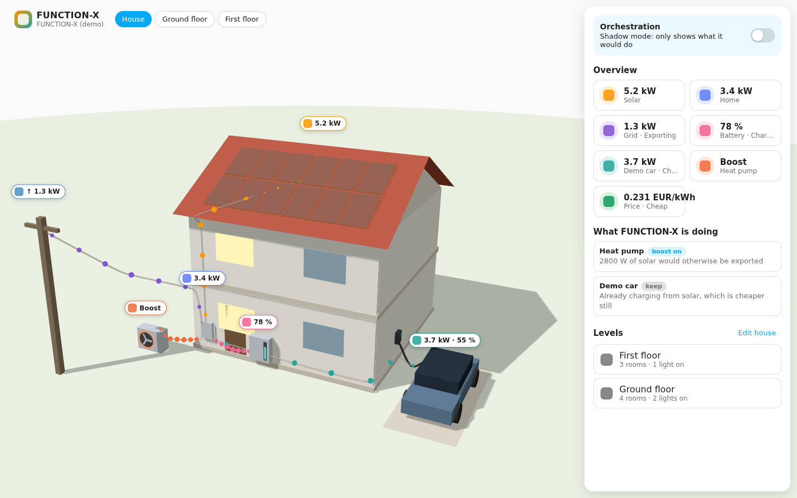
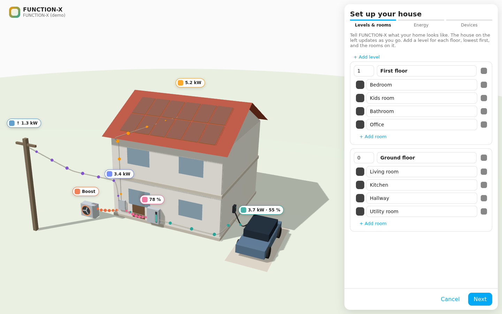
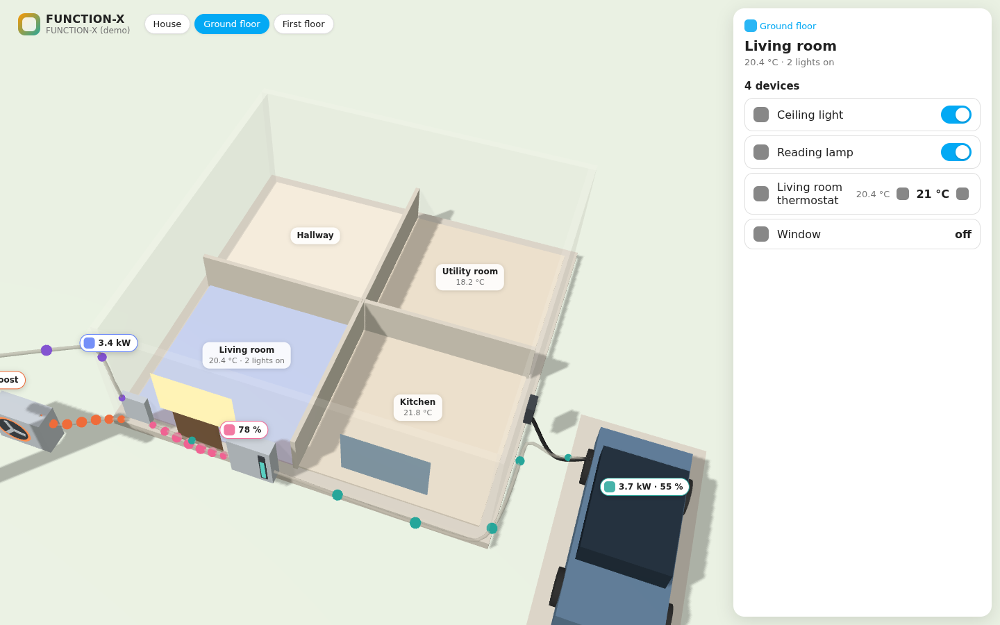
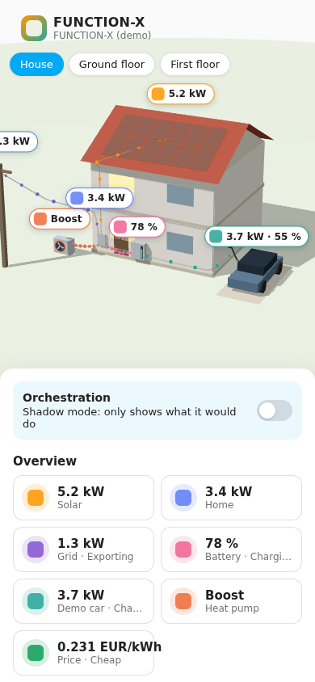

# FUNCTION-X Energy Orchestrator

A Home Assistant integration that makes separately bought energy devices (solar,
battery, wallbox, car, heat pump) work together. It reads the house through
[evcc](https://github.com/evcc-io/evcc), decides what each device should do, and
explains every decision in plain language.

**Status: early draft (v0.2).** Rule-based decisions, one heat pump boost switch,
car charging through evcc, a built-in demo house, and a 3D house dashboard in the
Home Assistant sidebar.



## The 3D house dashboard

After installing, **FUNCTION-X** appears in the Home Assistant sidebar.

- **The whole house:** solar on the roof, battery, heat pump, car(s) with
  wallbox, and the grid connection. Moving dots show where power flows right now
  (solar → house, house → car, export to the grid …). Windows light up in rooms
  where a light is on.
- **Click a level** (in 3D or on the chips at the top): the levels above lift
  away and you look into the rooms, with temperature and lights per room.
- **Click a room:** its lights, thermostats, covers and sensors, with controls.
- **Sidebar:** the Orchestration switch, live energy values, and what
  FUNCTION-X is doing and why.
- Works in light and dark mode, on desktop and phone, in English and German.

### Setting up your house

The first time you open the panel, a short guide asks:

1. **Levels & rooms:** add each floor (lowest first) and its rooms. The 3D house
   rebuilds as you type.
2. **Energy:** solar on the roof, home battery, heat pump, how many cars.
   Anything FUNCTION-X detected is already ticked.
3. **Devices:** lights, thermostats and sensors that aren't in a room yet each
   get a room dropdown.

The guide saves into Home Assistant's own **floors and areas**, so it stays in
sync with **Settings → Areas, labels & zones** and every device you add later.
Typing the name of a room that already exists links that room instead of making
a duplicate. Open the guide again at any time with **Edit house**; changing
floors and rooms needs an administrator account.

| Setup guide | Room view | Phone |
|---|---|---|
|  |  |  |

## What it does today

| Device | How it's controlled | Rule |
|---|---|---|
| Heat pump | Any `switch` / `input_boolean` (e.g. an SG Ready relay) | Boost when solar would be exported or power is cheap. Stop when the boost starts drawing from the grid or the battery. Minimum on/off times protect the compressor. |
| Car / wallbox | evcc charge mode | Fast-charge in the cheapest hours of the day, otherwise charge from solar. Never overrides "off" or a fast charge the user chose. |
| Solar, battery, grid, prices | Read from evcc (or a separate price sensor) | Input for the decisions. |

**Shadow mode:** the `Orchestration` switch starts **off**. FUNCTION-X then
only shows what it *would* do. Turn it on to let it act.

## Install in your test Home Assistant

### Option A: copy the folder (quickest)

1. Copy `custom_components/function_x` from this repo into your Home Assistant
   config folder as `/config/custom_components/function_x`. Use the Samba share,
   Studio Code Server or SSH add-on.
2. Restart Home Assistant.
3. **Settings → Devices & services → Add integration → "FUNCTION-X"**.

### Option B: HACS

1. HACS → three dots → **Custom repositories** → add
   `https://github.com/Stullee/FUNCTION-X` with category **Integration**.
2. Install "FUNCTION-X Energy Orchestrator", restart Home Assistant, then add
   the integration as above.

## First run: the demo house

Choose **Demo house** in the setup dialog. No hardware or evcc is needed.

- The simulated day starts at 10:00 and runs 12× faster than real time (a full
  day in about 2 hours). The heat pump uses midday solar. The car comes home at
  17:00 and charges in the cheap night hours.
- Leave "Heat pump boost switch" empty to use a simulated heat pump. Or create
  a toggle helper (**Settings → Devices & services → Helpers → Toggle**), select
  it, and watch FUNCTION-X switch it once Orchestration is on.
- Open **FUNCTION-X** in the sidebar. Without floors in Home Assistant it
  shows a sample two-storey house until you run the setup guide.
- Prefer standard cards? [`dashboards/function_x_demo.yaml`](dashboards/function_x_demo.yaml)
  is a classic Lovelace dashboard you can paste into the **Raw configuration editor**.

## Connecting a real house (evcc)

1. Install evcc, e.g. with the evcc Home Assistant add-on, and set up your
   inverter, battery, wallbox and car there.
2. Add FUNCTION-X and choose **evcc**. The URL is usually
   `http://<home-assistant-ip>:7070`.
3. Map your heat pump boost switch and, optionally, a dynamic-price sensor
   (Tibber, Nord Pool, …). Thresholds are under **Configure**.

## Entities

| Entity | Meaning |
|---|---|
| `switch.*_orchestration` | Off = shadow mode, on = act |
| `sensor.*_decision` | Summary of changes. Attributes hold every decision with its reason |
| `binary_sensor.*_heat_pump_boost_recommended` | What the heat pump should be doing |
| `sensor.*_solar_power`, `_grid_power`, `_home_consumption`, `_battery`, `_battery_power`, `_solar_surplus` | Site values in W / % |
| `sensor.*_electricity_price`, `_price_level` | Current price and whether it counts as cheap |
| `sensor.*_<loadpoint>_charging_power` | Per wallbox, with mode and car state of charge as attributes |

## Development

```bash
uv venv -p 3.13 .venv && uv pip install -p .venv/bin/python pytest-homeassistant-custom-component ruff
# The panel depends on HA's frontend package; install the version HA pins:
uv pip install -p .venv/bin/python "$(.venv/bin/python -c "import json,homeassistant.components.frontend as f,os;print(json.load(open(os.path.join(os.path.dirname(f.__file__),'manifest.json')))['requirements'][0])")"
.venv/bin/python -m pytest
.venv/bin/ruff check custom_components tests
```

Panel (source in `frontend/src`, built into
`custom_components/function_x/frontend/function-x-panel.js`, which is committed
so HACS installs need no build step):

```bash
cd frontend && npm install && npm run build   # or: npm run watch
# Preview with a fake Home Assistant (no HA needed):
cd .. && python3 -m http.server 8765
#   http://localhost:8765/frontend/dev/index.html   (?dark, ?narrow, ?configured=0&floors=0)
cd frontend && node dev/smoke.mjs            # clicks through the panel, checks actions
node dev/screenshots.mjs ../docs/screenshots # needs Playwright
```

Layout:

- `optimizer.py`: all decision logic, pure Python with no Home Assistant
  imports, so it can later move into a standalone service.
- `evcc.py`: evcc REST client. It accepts both old and new `/api/state` shapes.
- `demo.py`: the simulated house.
- `coordinator.py`: poll every 30 s → decide → apply (only when Orchestration is on).
- `panel.py` / `house.py`: registers the sidebar panel and its websocket API
  (`function_x/house`, `function_x/house/save`, `function_x/assign`), built on
  Home Assistant's floor, area, device and entity registries.
- `frontend/src/scene.js`: the three.js house; `panel.js`: sidebar, level/room
  views and the setup guide.

## Licensing note

evcc is MIT-licensed, but some wallbox and car integrations need an evcc
sponsor token per instance. Talk to evcc (info@evcc.io) before shipping this
commercially.
